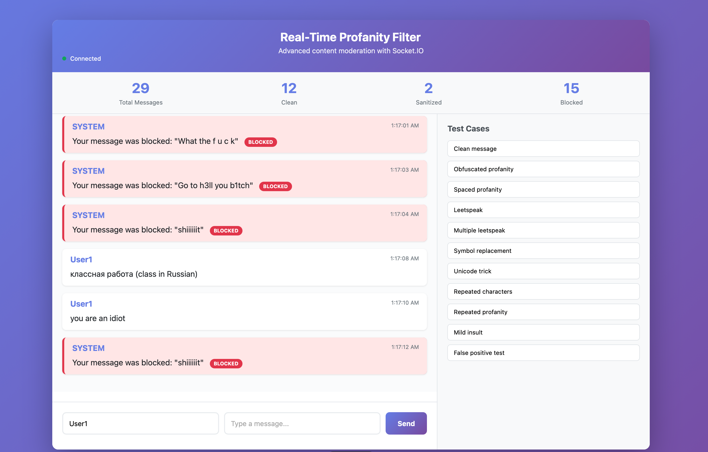

# Real-Time Profanity Filter System

A Socket.IO-based real-time profanity filtering system that detects and blocks inappropriate content with advanced pattern matching.

## Features

- **Real-time filtering** via WebSocket connections
- **Multiple detection strategies**:
  - Exact word matching
  - Partial word matching
  - Leetspeak/obfuscation detection (e.g., "h3ll0", "a$$")
  - Unicode/homoglyph detection
  - Whitespace/symbol injection detection
  - Case-insensitive matching
- **Comprehensive blocklist** with common profanity
- **Severity levels**: warn, block, or sanitize
- **Detailed logging** of filtered content

## Architecture

```
├── server.js              # Socket.IO server with real-time filtering
├── profanity-filter.js    # Core filter engine with detection algorithms
├── blocklist.js           # Profanity dictionary and word lists
├── client.html            # Test client interface
├── test-filter.js         # Comprehensive test suite
└── package.json           # Dependencies
```

## Installation

```bash
npm install
```

## Usage

1. Start the server:
```bash
npm start
```

2. Open `client.html` in a browser or navigate to `http://localhost:3000`

3. Send messages to test real-time filtering

## Testing

Run the comprehensive test suite:
```bash
npm test
```

## How It Works

1. **Client connects** via Socket.IO WebSocket
2. **Client sends message** to server
3. **Server filters message** through profanity detection engine
4. **Server blocks/sanitizes** inappropriate content
5. **Server broadcasts** clean message to all clients OR blocks completely
6. **Logs** filtered attempts for monitoring

## Detection Strategies

### 1. Exact Matching
Direct word matching against blocklist

### 2. Leetspeak Detection
Converts common substitutions: `@→a`, `3→e`, `1→i`, `0→o`, `$→s`, `7→t`

### 3. Obfuscation Detection
Detects words with inserted symbols/spaces: `a$$`, `h*ll`, `f u c k`

### 4. Unicode/Homoglyph Detection
Detects lookalike Unicode characters: `а` (Cyrillic) vs `a` (Latin)

### 5. Partial Matching
Catches profanity embedded in longer words

## Configuration

Edit `blocklist.js` to customize:
- Word severity levels
- Detection sensitivity
- Custom word lists

