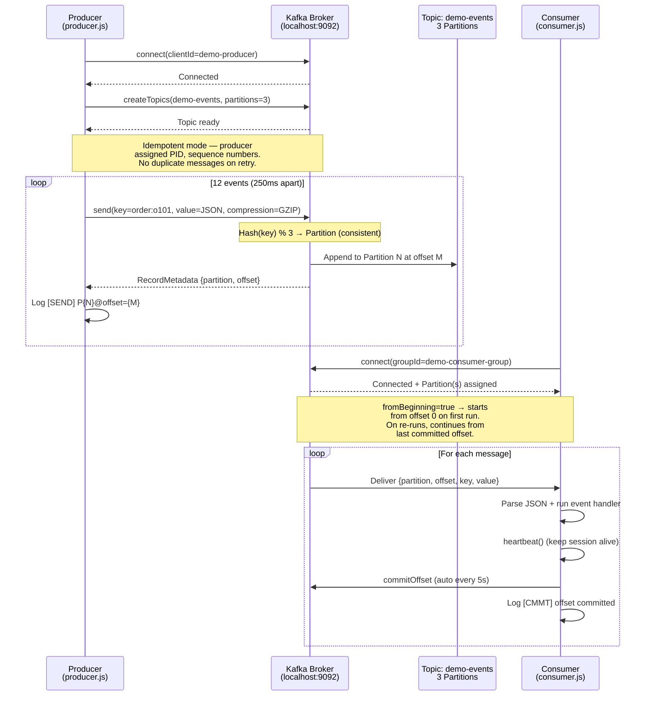

# Kafka — Architecture Schema Diagrams

## 1. Core Kafka Concepts

```
┌──────────────────────────────────────────────────────────────────────────┐
│                          Kafka Broker (KRaft mode)                       │
│                                                                          │
│  Topic: demo-events                                                      │
│  ┌──────────────────────────────────────────────────────────────────┐   │
│  │ Partition 0  [offset 0] → [offset 1] → [offset 2] → [offset 3]  │   │
│  ├──────────────────────────────────────────────────────────────────┤   │
│  │ Partition 1  [offset 0] → [offset 1] → [offset 2]               │   │
│  ├──────────────────────────────────────────────────────────────────┤   │
│  │ Partition 2  [offset 0] → [offset 1] → [offset 2]               │   │
│  └──────────────────────────────────────────────────────────────────┘   │
│                                                                          │
│  ⚠ Messages are IMMUTABLE — appended only, never deleted until           │
│    retention period (7 days in this POC)                                 │
└──────────────────────────────────────────────────────────────────────────┘
         ▲ produce                                             ▼ consume
  ┌──────┴────────┐                                  ┌────────┴────────┐
  │   Producer    │                                  │ Consumer Group  │
  │  producer.js  │                                  │  consumer.js    │
  │               │                                  │                 │
  │ key: user:u001│                                  │ Each consumer   │
  │ → Partition 0 │                                  │ in group owns   │
  │ key: user:u002│                                  │ one or more     │
  │ → Partition 2 │                                  │ partitions      │
  └───────────────┘                                  └─────────────────┘
```

---

## 2. Producer → Topic → Consumer Sequence



---

## 3. Key Architecture: Log-Based Storage vs Queue

```
  RabbitMQ (Queue model)         Kafka (Log model)
  ──────────────────────         ─────────────────
  Message → [Q] → ACK            Message → [Log] → never deleted*
       consumed = deleted              offset pointer moves forward

  ┌──────────────────┐          ┌────────────────────────────────┐
  │   demo_queue     │          │   Partition 0 (append-only)    │
  │ ░░░░░░░░░░░░░░░ │          │  0   1   2   3   4   5   6...  │
  │ consumed → empty │          │ [e] [e] [e] [e] [e] [e] [e]  │
  └──────────────────┘          │              ↑                 │
                                │         Consumer A             │
  Consumer ACKs = delete        │              ↑                 │
                                │         Consumer B (replay!)   │
  Can't replay old msgs         └────────────────────────────────┘

  *Deleted after retention period (default 7 days)
```

---

## 4. Partition Key → Partition Assignment

Events are keyed so **all events for the same entity land on the same partition**, guaranteeing ordering:

```
Key               Hash → Partition   Events on this partition
────────────────  ─────────────────  ─────────────────────────
order:o101        hash % 3 = P0      order.placed → payment.succeeded → order.shipped → order.delivered
order:o102        hash % 3 = P1      order.placed → payment.failed → payment.retried → payment.succeeded
user:u001..u003   hash % 3 = P?      user.signup (one per user)
system:node-1     hash % 3 = P?      system.ping
```

> **Ordering guarantee**: Within a partition, offset order = event order. Cross-partition: no guarantee.

---

## 5. Consumer Group Semantics

```
Topic: demo-events (3 partitions)

  If 1 consumer in group:
  ┌─────────────┐
  │ Consumer A  │ ← owns Partition 0, 1, 2 (all)
  └─────────────┘

  If 2 consumers in group (horizontal scale):
  ┌─────────────┐   ┌─────────────┐
  │ Consumer A  │   │ Consumer B  │
  │  P0, P1     │   │  P2         │
  └─────────────┘   └─────────────┘

  If 3 consumers in group (max parallelism):
  ┌──────┐   ┌──────┐   ┌──────┐
  │  A   │   │  B   │   │  C   │
  │  P0  │   │  P1  │   │  P2  │
  └──────┘   └──────┘   └──────┘

  If 4+ consumers in group (one idle):
  ┌──────┐   ┌──────┐   ┌──────┐   ┌──────┐
  │  A   │   │  B   │   │  C   │   │  D   │
  │  P0  │   │  P1  │   │  P2  │   │ idle │
  └──────┘   └──────┘   └──────┘   └──────┘
```

---

## 6. Message Envelope

```json
{
  "id":        "evt-1709300000000-ab3x",
  "eventType": "order.placed",
  "payload": {
    "orderId": "o101",
    "userId":  "u001",
    "total":   49.99,
    "items":   3
  },
  "meta": {
    "producedAt": "2026-03-01T08:00:00.000Z",
    "source":     "producer.js",
    "version":    "1.0"
  }
}
```

AMQP/Kafka properties:
| Property      | Value               | Purpose                                |
|---------------|---------------------|----------------------------------------|
| `key`         | `order:o101`        | Route to same partition, guarantee order|
| `compression` | GZIP                | Reduce network bandwidth                |
| `headers`     | event-type, key     | Metadata without parsing the value     |
| Idempotent    | PID + seq number    | No duplicates on producer retry         |
| `fromBeginning` | true              | Consumer replays all history on first run|
