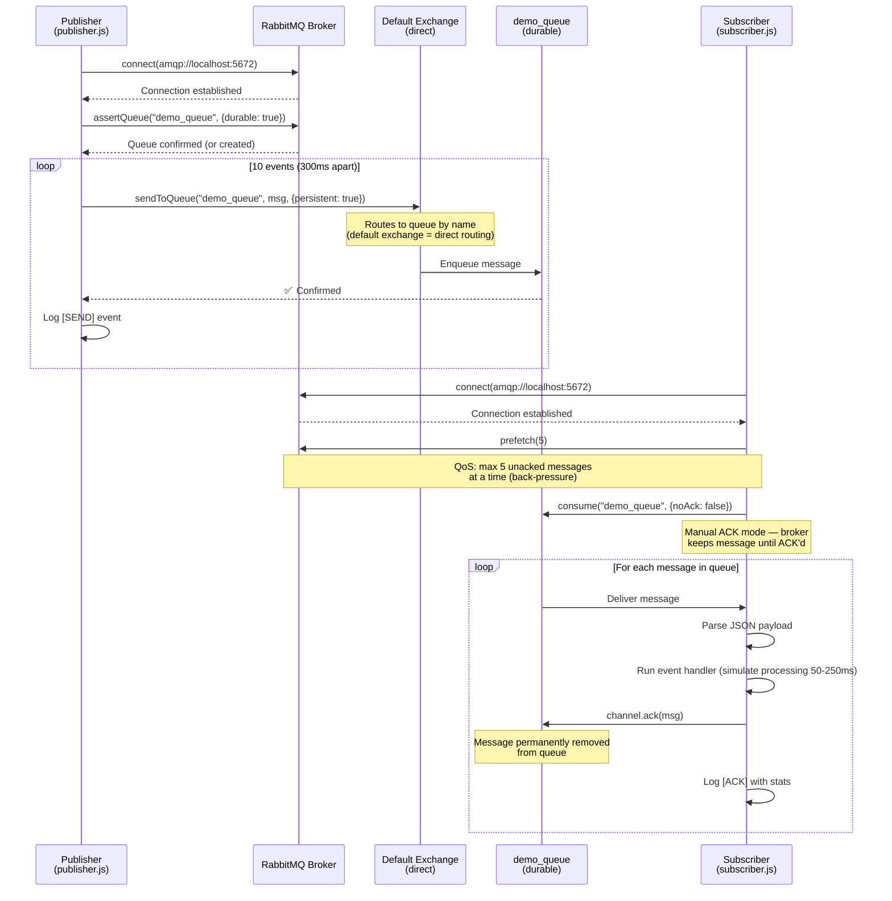

# RabbitMQ — Architecture Schema Diagrams

## 1. Core AMQP Concepts

```
┌─────────────────────────────────────────────────────────────────────┐
│                        RabbitMQ Broker                              │
│                                                                     │
│   ┌─────────────┐    route    ┌──────────────┐   deliver    ┌─────┐│
│   │  Exchange   │────────────▶│    Queue     │─────────────▶│ Q   ││
│   │  (router)   │  by binding │  demo_queue  │              │ u   ││
│   └─────────────┘             └──────────────┘              │ e   ││
│         ▲                     ┌──────────────┐              │ u   ││
│         │                     │    Queue 2   │              │ e   ││
│         │          route      │  (dead_letter│              │ 2   ││
│         │─────────────────────│   _queue)    │              └─────┘│
└─────────┼───────────────────────────────────────────────────────────┘
          │                                                        ▲
          │ publish                                         consume │
   ┌──────┴──────┐                                       ┌─────────┴────┐
   │  Publisher  │                                       │  Subscriber  │
   │ publisher.js│                                       │ subscriber.js│
   └─────────────┘                                       └──────────────┘
```

---

## 2. Publisher → Exchange → Queue → Subscriber Flow



---

## 3. Message Lifecycle

```
[PUBLISHER]                [BROKER / QUEUE]              [SUBSCRIBER]

  Publish msg                                              
  {persistent:true}  ────▶  Stored to disk   
  {contentType:json}         (durable=true,              
  {headers: ...}              msg survives              
                              broker restart)              
                                                           Consume msg
                             Queue depth: N  ────────────▶ Parse JSON
                                                           Run handler
                             Queue depth: N-1 ◀──────────  ACK
                             (message deleted)             (or NACK to
                                                           requeue/discard)
```

---

## 4. Message Envelope Structure

Every message published has this JSON envelope:

```json
{
  "id":        "msg-1709300000000-ab3x7",
  "eventType": "order.placed",
  "payload": {
    "orderId": "o101",
    "userId":  "u001",
    "total":   49.99,
    "items":   3
  },
  "meta": {
    "publishedAt": "2026-03-01T08:00:00.000Z",
    "source":      "publisher.js",
    "version":     "1.0"
  }
}
```

AMQP Properties attached at publish time:
| Property       | Value                  | Purpose                          |
|----------------|------------------------|----------------------------------|
| `persistent`   | `true` (deliveryMode=2)| Survives broker restart          |
| `contentType`  | `application/json`     | Hints to consumer how to parse   |
| `x-event-type` | e.g. `order.placed`    | Header for routing/filtering     |
| `x-retry-count`| `0`                    | Track retry attempts             |

---

## 5. Exchange Types (Reference)

```
Type       │ Routing Logic                    │ Use Case
───────────┼──────────────────────────────────┼───────────────────────────────
direct     │ Exact routing key match          │ Task queues (this demo)
fanout     │ Broadcast to ALL bound queues    │ Notifications, cache invalidation
topic      │ Pattern match on routing key     │ Microservices (*.order.# patterns)
headers    │ Match on message header values   │ Complex attribute-based routing
```

---

## 6. RabbitMQ vs Other MQ Systems

```
┌─────────────────┬─────────────┬────────────┬───────────────────────────┐
│ Feature         │ RabbitMQ    │ Amazon SQS │ Apache Kafka              │
├─────────────────┼─────────────┼────────────┼───────────────────────────┤
│ Protocol        │ AMQP        │ HTTP/SQS   │ Custom (Kafka protocol)   │
│ Message model   │ Push        │ Pull       │ Pull (log-based)          │
│ Message order   │ Per queue   │ Best-effort│ Per partition (strict)    │
│ Message replay  │ ❌ (ack=del) │ ❌ (del)   │ ✅ (offset replay)        │
│ Routing         │ Exchange    │ None       │ Topics/partitions         │
│ Delivery        │ At-most/once│ At-least   │ Exactly-once (w/ txn)    │
│ Best for        │ Task queues │ Serverless │ Event streaming at scale  │
│                 │ pub/sub     │ decoupling │                           │
└─────────────────┴─────────────┴────────────┴───────────────────────────┘
```
