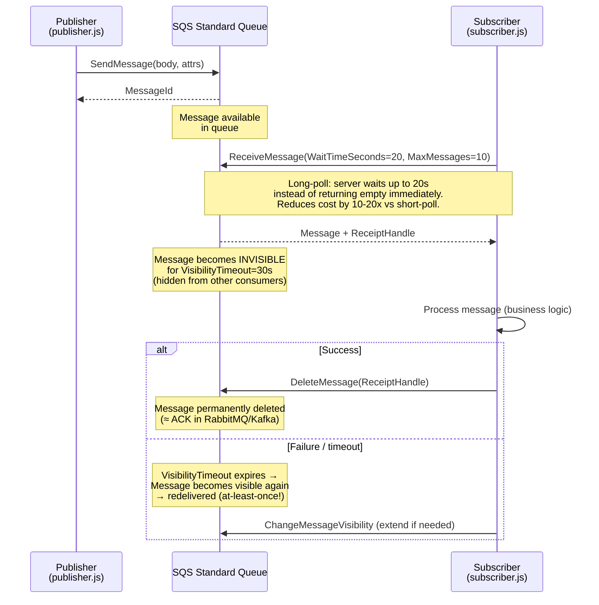

# Amazon SQS — Architecture Schema Diagrams

## 1. Core SQS Concepts

```
               ┌──────────────────────────────────────────────────────┐
               │               Amazon SQS (or LocalStack)             │
               │                                                      │
               │  Standard Queue (demo-standard-queue)                │
               │  ┌─────────────────────────────────────────────────┐ │
               │  │  [msg1] [msg2] [msg3] [msg4] [msg5] [msg6]     │ │
               │  │  at-least-once delivery, best-effort ordering   │ │
               │  └─────────────────────────────────────────────────┘ │
               │                                                      │
               │  FIFO Queue (demo-fifo-queue.fifo)                   │
               │  ┌─────────────────────────────────────────────────┐ │
               │  │  GroupId: order:o201                             │ │
               │  │  [order.created] → [confirmed] → [shipped] → [delivered]│
               │  │  GroupId: user:u001                             │ │
               │  │  [account.tier_upgrade]                         │ │
               │  │  exactly-once, strict order WITHIN each group   │ │
               │  └─────────────────────────────────────────────────┘ │
               └──────────────────────────────────────────────────────┘
       ▲ SendMessage                                  ▼ ReceiveMessage + DeleteMessage
┌──────┴────────┐                              ┌────────┴──────────┐
│   publisher   │                              │   subscriber.js   │
│  publisher.js │                              │                   │
│               │                              │  long-poll 20s    │
│ SendMessage   │                              │  visibility=30s   │
│ with attrs    │                              │  delete = ACK     │
└───────────────┘                              └───────────────────┘
```

---

## 2. SQS Message Lifecycle (Standard Queue)



---

## 3. Standard vs FIFO Queue Comparison

```
Feature                   Standard Queue          FIFO Queue (.fifo)
────────────────────────  ──────────────────────  ──────────────────────────
Delivery guarantee        At-least-once           Exactly-once (5-min window)
Ordering                  Best-effort             Strict per MessageGroupId
Throughput                Unlimited               300 msgs/s (3000 with batching)
Deduplication             Manual (your code)      Built-in (MessageDeduplicationId)
Use cases                 Email, resizing, jobs   Financial txns, order lifecycle
MessageGroupId            ❌                      ✅ Required
DeduplicationId           ❌                      ✅ Required (or content-based)
```

---

## 4. Visibility Timeout — Key Concept

```
Time ─────────────────────────────────────────────────────────────────▶

  t=0s   Message arrives in queue
  t=0s   Consumer A receives message → becomes INVISIBLE (timeout=30s)
  t=10s  Consumer A successfully processes → DeleteMessage → GONE ✅

  If Consumer A crashes:
  t=0s   Message arrives in queue
  t=0s   Consumer A receives → INVISIBLE for 30s
  t=30s  Timeout expires → message REAPPEARS in queue
  t=30s  Consumer B picks it up (at-least-once delivery!)

  VisibilityTimeout should be set to > your max processing time
```

---

## 5. Message Attributes (SQS metadata)

```json
// Sent with each message — queryable without parsing body
{
  "MessageAttributes": {
    "EventType": {
      "DataType": "String",
      "StringValue": "notification.email"
    },
    "EventGroup": {
      "DataType": "String",
      "StringValue": "email"
    },
    "SchemaVersion": {
      "DataType": "Number",
      "StringValue": "1"
    }
  }
}
```

---

## 6. SQS vs RabbitMQ vs Kafka

```
Feature              SQS                    RabbitMQ            Kafka
───────────────────  ─────────────────────  ──────────────────  ─────────────────────
Model                Pull (poll)            Push                Pull (poll log)
Message replay       ❌ deleted on delete   ❌ ACK = delete     ✅ replay by offset
Ordering             Best-effort (std)      Per queue           Per partition
Exactly-once         FIFO only             With plugins        With txns
Managed?             ✅ AWS fully managed   ❌ Self-hosted       ❌ Self/MSK on AWS
Local dev            LocalStack            Docker/native       Docker/native
Max message size     256KB                 Configurable        1MB (default)
Max retention        14 days               Policy-based        7 days (default)
Best for             Serverless, decoupled  Complex routing     High-throughput streams
```
